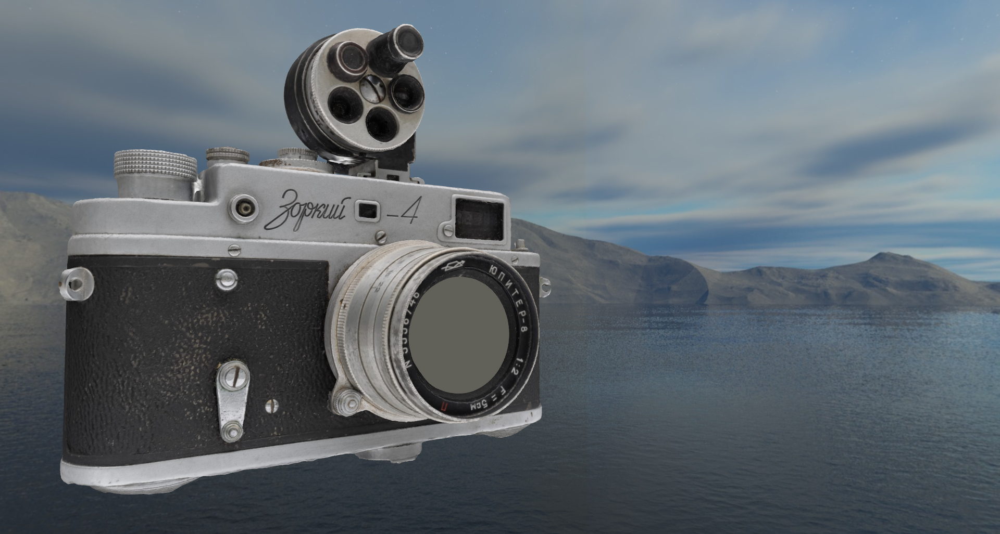
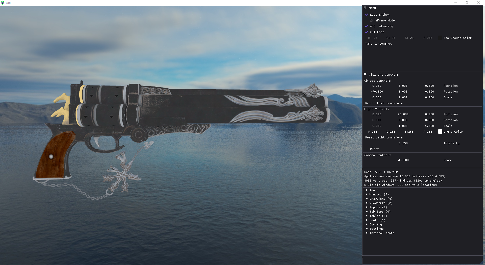

<h1 align="center">ORE (OPENGL RENDERING ENGINE)</h1>

<br/>

<p align="center">

 
 </p>

 <p align="center">
 
 
</p>

## What is ORE?

ORE(OpenGL Rendering Engine) is a rendering engine with great and easy to use UI that allows the user to load and view their 3D models in realtime.

PS: I am developing this project for my college minor assessment

<!-- [MODEL CREDITS](resources/LICENSE "Model License") -->

## ORE Inside Previews

Some of the images are taken using ORE inbuilt screenshot system.





<div style="padding:52.71% 0 0 0;position:relative;"><iframe src="https://player.vimeo.com/video/653409636?h=a88356e879&amp;badge=0&amp;autopause=0&amp;player_id=0&amp;app_id=58479" frameborder="0" allow="autoplay; fullscreen; picture-in-picture" allowfullscreen style="position:absolute;top:0;left:0;width:100%;height:100%;" title="ORE - 2021.12.05"></iframe></div><script src="https://player.vimeo.com/api/player.js"></script>

## ORE Controls and Features

<h6> Controls</h6>

| Action         | Key             |
| -------------- | --------------- |
| Move Forward   | W               |
| Move Backward  | S               |
| Move Left      | A               |
| Move Right     | D               |
| Mouse Movement | Left Alt + Drag |
| Zoom in/out    | Mouse Scroll    |

<h6> Features</h6>

| Features                  | Status             |
| ------------------------- | ------------------ |
| Anti Aliasing             | :heavy_check_mark: |
| WireFrame Mode            | :heavy_check_mark: |
| SkyBox Loading            | :heavy_check_mark: |
| ViewPort Camera           | :heavy_check_mark: |
| Screenshot System         | :heavy_check_mark: |
| Light Source Color change | :heavy_check_mark: |
| BackGround Color change   | :heavy_check_mark: |
| Logging System            | :heavy_check_mark: |
| Transformation System     | :heavy_check_mark: |
| Performance Viewer        | :heavy_check_mark: |
| Spot Light                | :heavy_check_mark: |

## Getting Started

Start by cloning the repository with

```

git clone --recursive https://github.com/harshit2608/ORE.git

```

If the repository was cloned non-recursively previously, use
`git submodule update --init`
to clone the necessary submodules.

## How to build ORE?

<h5>Make sure you have python installed on your system</h5>

After cloning the repository run `build.bat` and select yes to install the `googledrivedownloader` package to get the assets from `gdrive`

To build ORE you need to have [CMAKE](https://cmake.org/download/)

<h4>Building ORE on windows</h4>

**MSVC**
Download MSVC from [here](https://visualstudio.microsoft.com/vs/features/cplusplus/)

Open command prompt in root directory and type the following commands:

```

mkdir build && cd build
cmake -G "Visual Studio 16 2019" -A x64 -DCMAKE_BUILD_TYPE=Release ..

```

**MINGW**
Download MinGW from [here](https://www.mingw-w64.org)

Open command prompt in root directory and type the following commands:

```

mkdir build && cd build
cmake -G "MinGW Makefiles" -DCMAKE_BUILD_TYPE=Release ..

```

<h4>Building ORE on Linux</h4>

**PROJECT IS UNDERDEVELOPMENT AND HASN'T BEEN TESTED ON LINUX!!**

```

```
